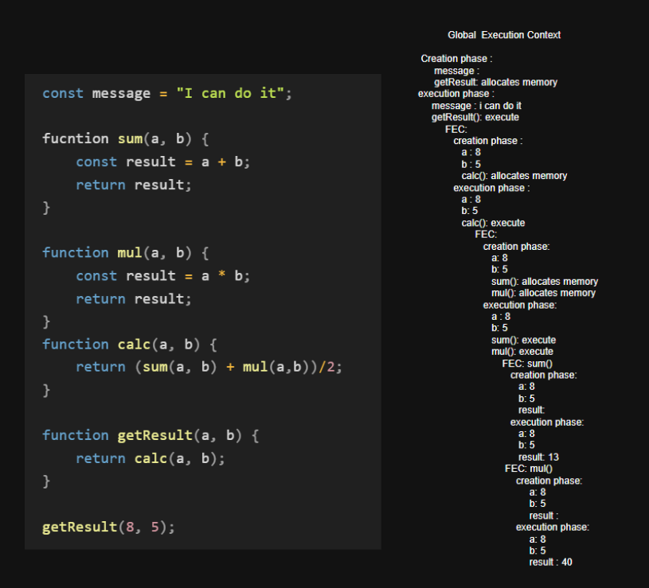
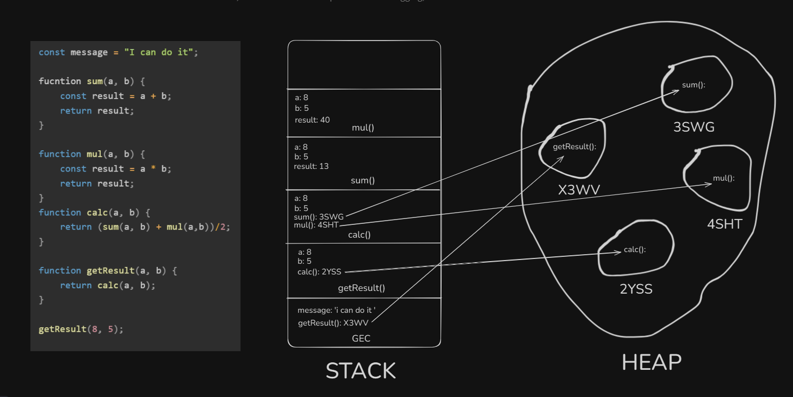
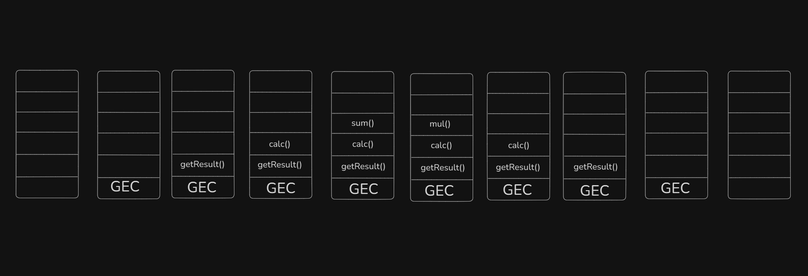

# this is the global execution with creation phase and execution phase solve.
this image demonstrates how javascript execution happens when the code runs

# this is the creation of stack flow and heap memory
this is how javascript memory manage ments works according stack, heap

# this is the stack flow when it gets in and pops off from the stack 

